# LDPC系统完整流程图分析

## 1. 系统整体启动流程图

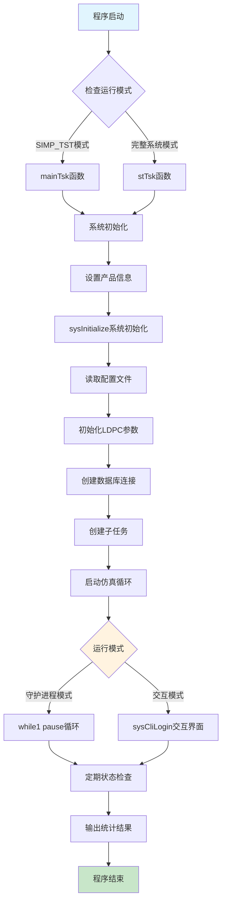

## 2. 主任务创建和调度流程图

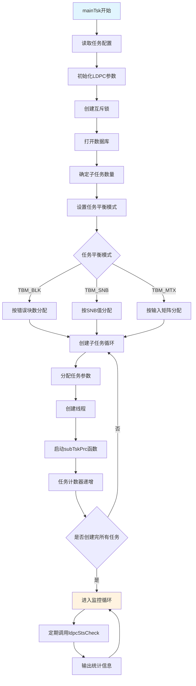

## 3. 子任务处理流程图

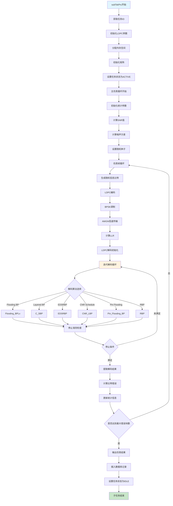

## 4. 系统状态机流程图

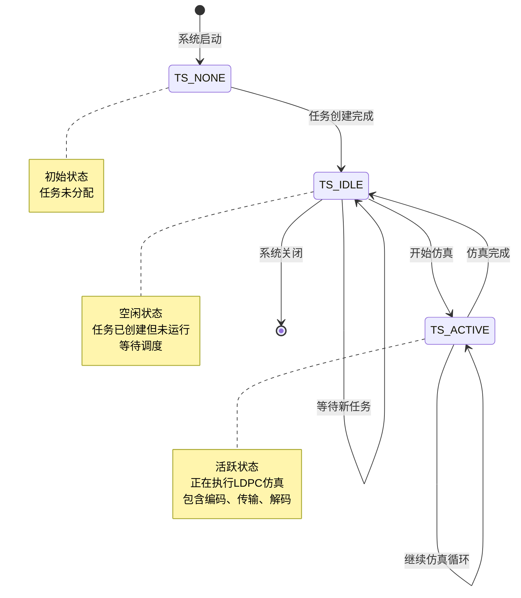

## 5. 任务平衡模式状态机

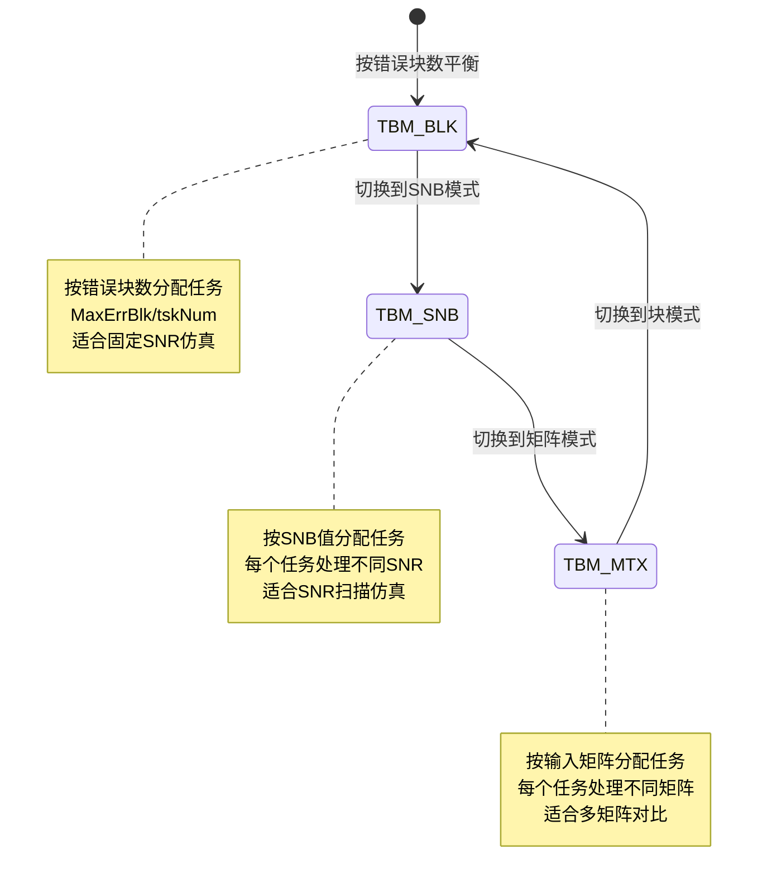

## 6. 多线程加速原理流程图

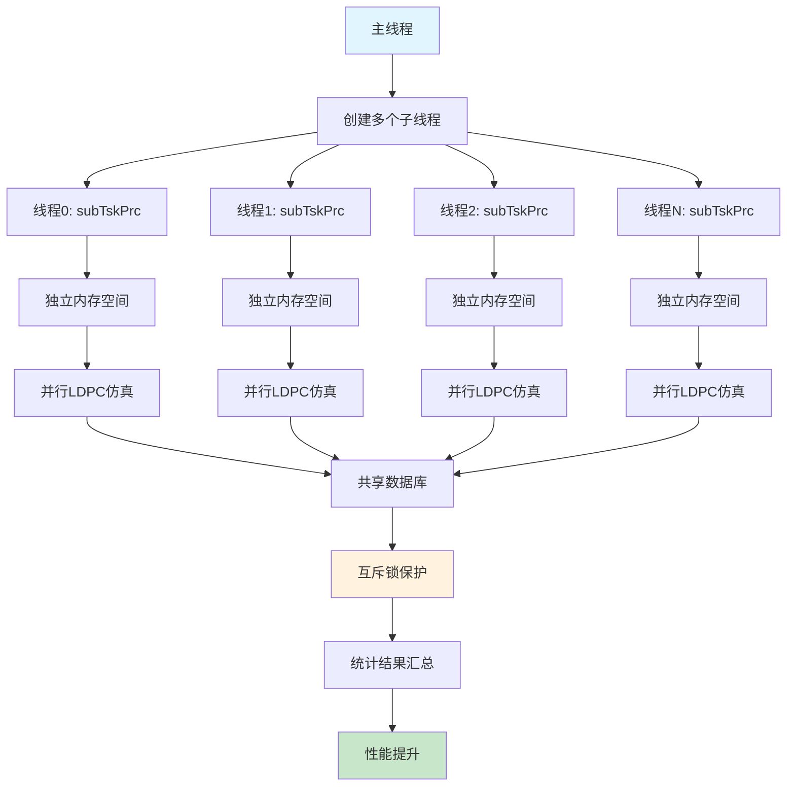

## 7. 线程间通信和同步机制

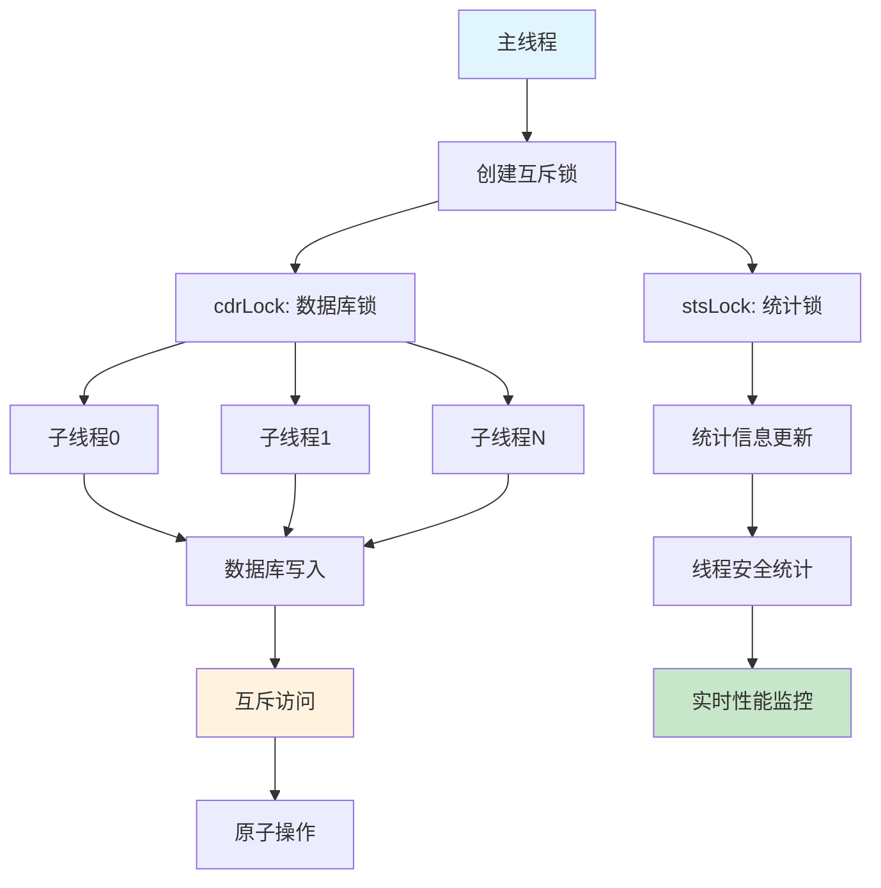

## 8. LDPC解码算法选择流程图

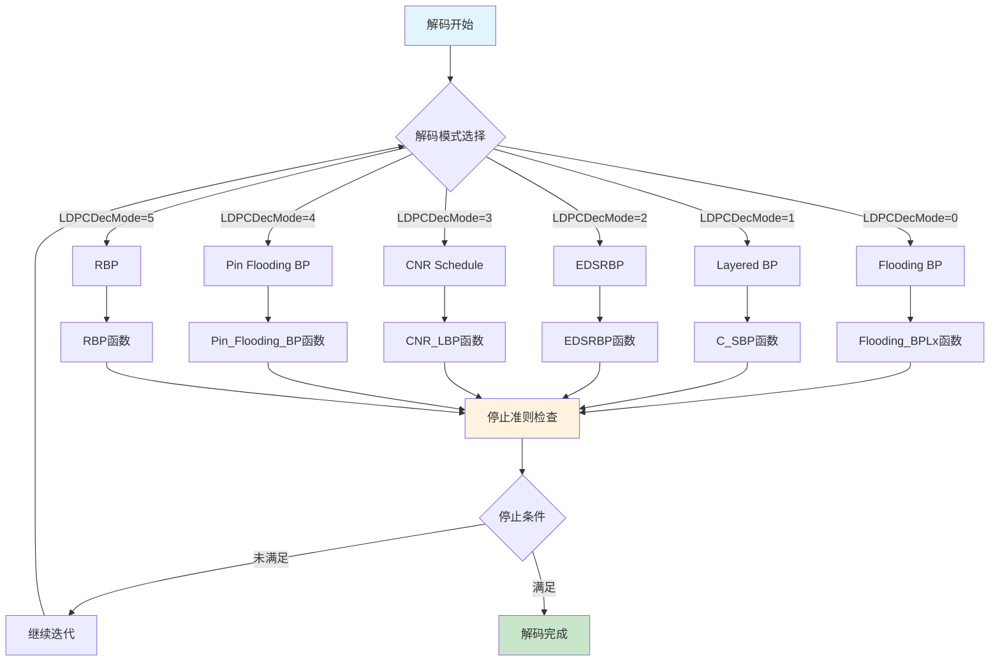

## 9. 停止准则流程图

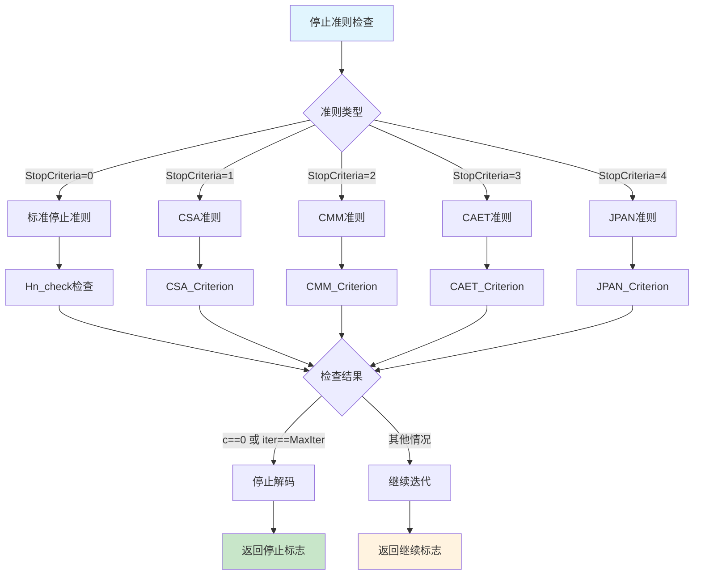

## 10. 数据库操作流程图

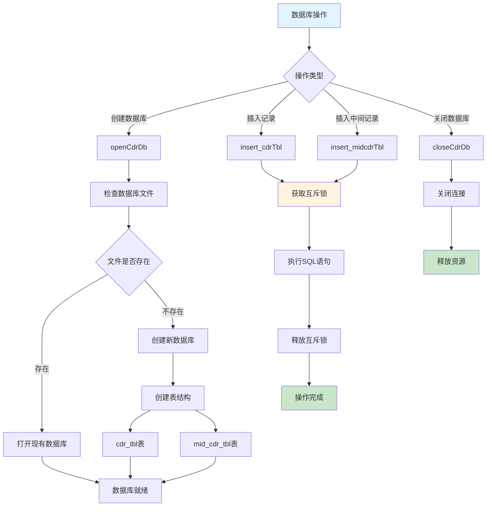

## 11. 性能监控和统计流程图

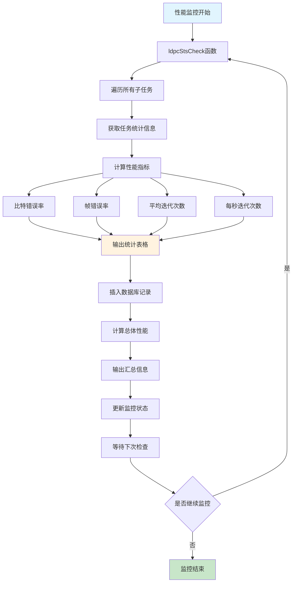

## 12. 内存管理流程图

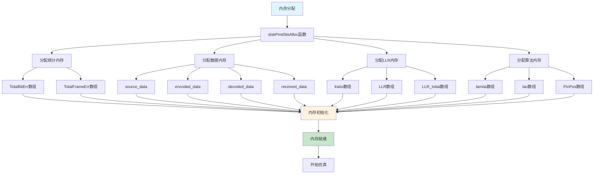

## 总结

这个LDPC系统采用了以下关键技术：

1. **多线程并行处理**：通过创建多个子线程同时进行LDPC仿真，显著提升计算性能
2. **任务平衡机制**：支持多种任务分配策略，适应不同的仿真需求
3. **状态机管理**：清晰的任务状态转换，确保系统稳定运行
4. **互斥同步**：通过互斥锁保护共享资源，保证数据一致性
5. **实时监控**：定期检查各线程状态，输出性能统计信息
6. **数据库记录**：将仿真结果持久化存储，便于后续分析

整个系统设计合理，具有良好的可扩展性和稳定性，能够高效地进行LDPC码的性能仿真。 